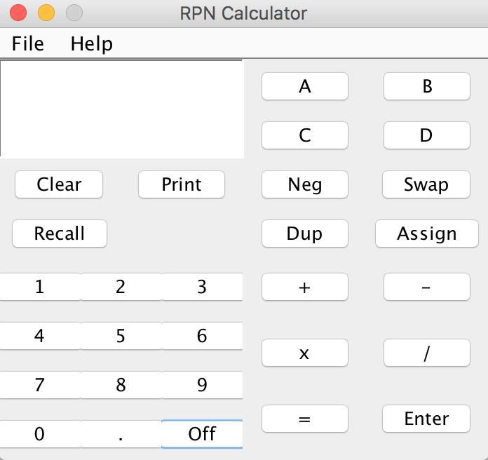
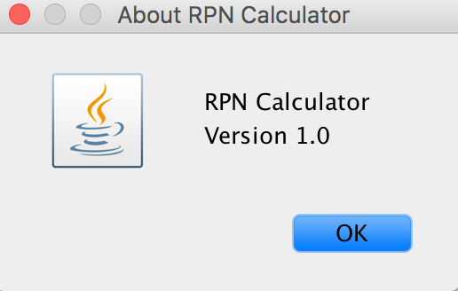
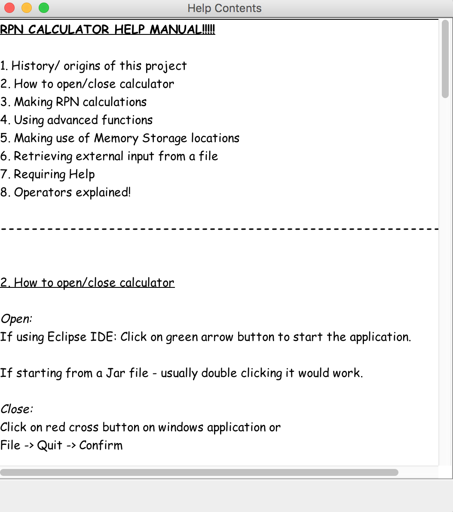
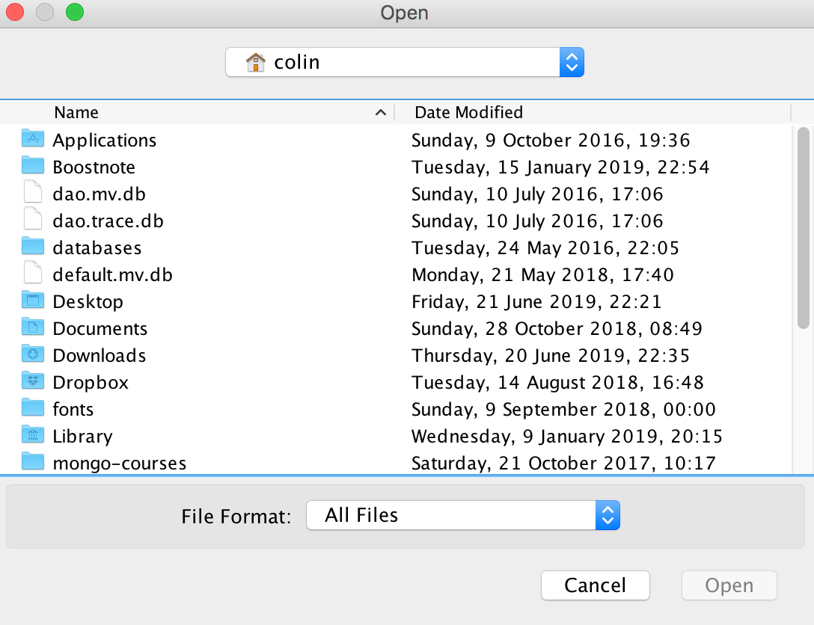

# RPN Calculator

------------------------------------------------------------------------
This is the project README file. This is a RPN Calculator.
Includes a GUI!
------------------------------------------------------------------------

PROJECT TITLE: RPN Calculator

PURPOSE OF PROJECT: Interest

VERSION or DATE: 1.0

HOW TO START THIS PROJECT: 
To start this project you click on run button on the class main.java
This class is a driver class which starts a program.

AUTHORS: Colin But

USER INSTRUCTIONS:

The objective of the calculator is for use. 

On how to use this calculator, you can find it in the help manual
which is situated in "help.txt" and can also be launched from the help menu item.

You can import using the open dialog from the file menu.

